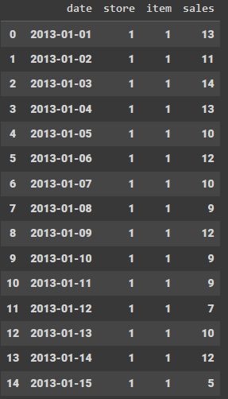
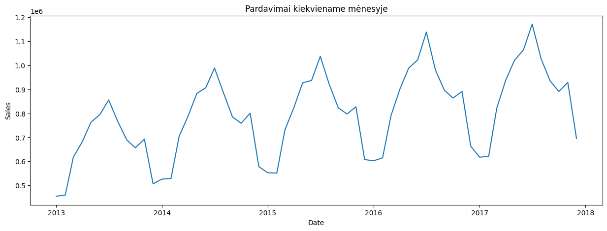
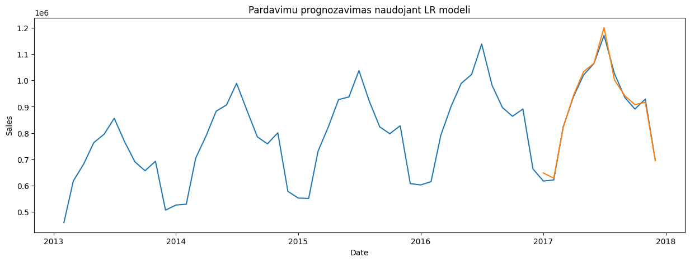
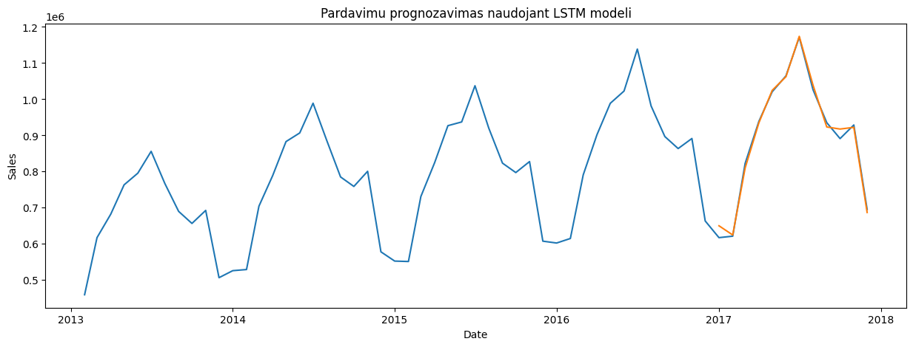

# Sales Forecasting using Machine Learning

## Overview

Sales forecasting approach utilizes two powerful models: linear regression and LSTMs. Exploration revealed that LSTMs achieved superior results when analyzing past twelve months of monthly sales data to predict the next twelve months. This suggests that the sales patterns might exhibit significant non-linearity, which LSTMs are adept at capturing.

## Data

Contains about 500.000 entries. Data was aggregated by summing the sales for each month.

## Screenshots

### Sales

### Linear Regression forecast

### LSTM forecast

